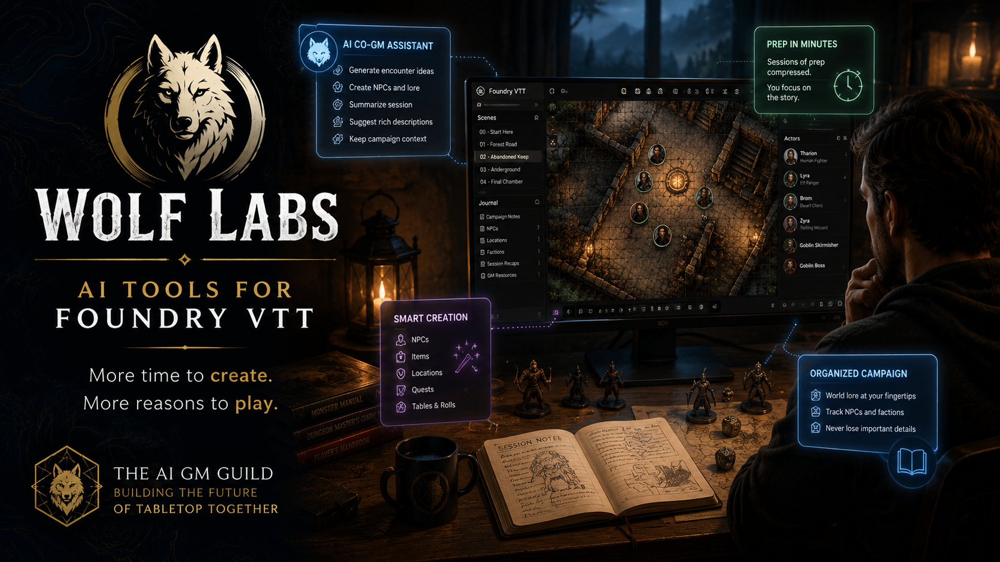

<p align="center">

&#x20; 

</p>


<h1 align="center">🐺 Wolf Labs Community</h1>


<p align="center">

&#x20; <strong>More time to create. More reasons to play.</strong>

</p>


<p align="center">

&#x20; Community infrastructure for <strong>The AI GM Guild</strong> — a community exploring practical AI-assisted tabletop gaming, Foundry VTT development, and tools that give Game Masters more time to create.

</p>


\---


\## 🎲 What is Wolf Labs?


\*\*Wolf Labs\*\* builds AI-assisted tools for tabletop roleplaying games, with an initial focus on \*\*Foundry VTT\*\*.


Our philosophy is simple:


> \*\*Every feature should give the GM more time to create.\*\*


We don't want AI to replace the Game Master.


We want it to work beside them.


The GM provides the imagination, judgment, personality, and creative direction. AI handles the repetitive generation, organization, retrieval, and other busy work that can consume valuable preparation and play time.


The goal is an \*\*AI co-GM\*\*: technology that supports creativity rather than replacing it.


\---


\## 🏰 The AI GM Guild


\*\*The AI GM Guild\*\* is the community surrounding Wolf Labs.


It's a place for:


\- 🎲 Game Masters

\- 🧙 Players

\- 🔨 Foundry VTT users

\- 💻 Foundry developers

\- 🤖 AI developers

\- 🌍 Worldbuilders

\- 🧪 Beta testers

\- 📚 People discovering tabletop RPGs


The Guild isn't just a support server.


It's where we explore what AI-assisted tabletop gaming should become.


Community feedback helps identify frustrating workflows, inspire new tools, test experimental features, report problems, and shape future Wolf Labs projects.


\---


\## 🧠 Our Approach to AI


AI should make tabletop gaming \*\*more human, not less\*\*.


A useful AI tool might help a GM:


\- Generate supporting material from their ideas

\- Develop NPCs and locations

\- Organize campaign information

\- Maintain campaign context

\- Prepare encounters

\- Explore alternatives

\- Summarize sessions

\- Retrieve important information quickly

\- Automate repetitive Foundry workflows


But the interesting decisions stay with the person running the game.


\*\*AI handles the busy work. You create the world.\*\*


\---


\## 🔨 What Is This Repository?


`wolflabs-community` contains the infrastructure used to build and manage \*\*The AI GM Guild Discord community\*\*.


The server is largely defined as configuration and deployed through the \*\*Wolf Labs Architect\*\* Discord bot.


Instead of manually rebuilding server infrastructure, we describe the community in version-controlled configuration.


```text

wolflabs-community/

│

├── assets/

│   └── wolf-labs-banner.png

│

├── config/

│   ├── server.yml

│   ├── roles.yml

│   ├── permissions.yml

│   ├── messages.yml

│   └── onboarding.yml

│

├── src/

│   ├── bot.py

│   └── deploy.py

│

├── .env.example

├── .gitignore

├── requirements.txt

└── README.md

```


\---


\## 🤖 Wolf Labs Architect


\*\*Wolf Labs Architect\*\* is the Discord bot responsible for community infrastructure and interactive features.


Current capabilities include:


\### Infrastructure as Configuration


Discord categories, channels, roles, permissions, forums, tags, and community messages can be defined in YAML and deployed programmatically.


\### Interactive Onboarding


New members can select roles based on how they participate in tabletop gaming and what they're interested in.


Examples include:


\- Game Master

\- Player

\- Developer

\- AI for GMing

\- Worldbuilding

\- Foundry Tools

\- AI Development

\- Learning TTRPGs

\- Beta Tester


\### Personalized Guild Paths


Members can receive recommendations based on their selected interests, helping them find relevant parts of the community without navigating an overwhelming server.


\### Structured Community Feedback


Discord Forums provide dedicated spaces for:


\- 🐛 Bug reports

\- 💡 Feature requests

\- 🧪 Experimental ideas

\- 🖼️ Community showcases


This creates a foundation for community-driven product development.


\---


\## 🚀 Getting Started


Clone the repository:


```bash

git clone https://github.com/YOUR-USERNAME/wolflabs-community.git

cd wolflabs-community

```


Create a virtual environment:


```bash

python -m venv .venv

```


On Windows PowerShell:


```powershell

.\\.venv\\Scripts\\Activate.ps1

```


Install dependencies:


```bash

pip install -r requirements.txt

```


Copy the environment template:


```powershell

Copy-Item .env.example .env

```


Then configure:


```env

DISCORD\_BOT\_TOKEN=YOUR\_BOT\_TOKEN

DISCORD\_GUILD\_ID=YOUR\_SERVER\_ID

```


> ⚠️ Never commit `.env` or your Discord bot token to GitHub.


\---


\## 🏗️ Deploying the Guild


The Discord server infrastructure can be deployed with:


```bash

python -m src.deploy

```


The deployment system creates and configures server resources from the files in `config/`.


The deployment process is designed to be \*\*idempotent\*\* wherever practical: running it repeatedly should update or preserve existing infrastructure rather than continually creating duplicates.


\---


\## 🐺 Running Wolf Labs Architect


Start the interactive Discord bot with:


```bash

python -m src.bot

```


The bot currently provides onboarding and member-facing community features.


For example:


```text

/post-onboarding

```


creates the interactive Guild onboarding panel.


```text

/my-path

```


provides personalized community recommendations based on a member's selected roles.


\---


\## 🗺️ Where We're Going


Wolf Labs is still early.


The broader vision includes:


\- AI-assisted Foundry VTT modules

\- Campaign-aware AI assistance

\- GM preparation tools

\- NPC and worldbuilding workflows

\- Campaign memory and retrieval

\- Foundry automation

\- Community-driven feature development

\- Beta testing infrastructure

\- Discord ↔ GitHub development workflows

\- Local and cloud AI integrations


The exact tools will evolve as we learn what genuinely saves GMs time.


That's intentional.


We would rather build around real tabletop workflows than add AI simply because we can.


\---


\## 💡 The Question We're Asking


If AI could quietly take \*\*one tedious task\*\* off a Game Master's plate without taking away any creative control...


\*\*What would you have it do?\*\*


That's the question behind Wolf Labs.


\---


\## 🤝 Contributing


Wolf Labs is being developed alongside its community.


Developers, Game Masters, players, worldbuilders, testers, and curious experimenters are welcome to participate.


As individual Wolf Labs Foundry modules are developed, they may live in their own repositories while this repository remains focused on community infrastructure.


Contribution guidelines will expand as the project grows.


\---


\## 📜 License


See the repository's `LICENSE` file for licensing terms.


\---


<p align="center">

&#x20; 🐺 <strong>WOLF LABS</strong>

</p>


<p align="center">

&#x20; <strong>More time to create.<br>

&#x20; More reasons to play.</strong>

</p>


<p align="center">

&#x20; Building the future of tabletop together.

</p>

